# 個人メモ・テックノート
# 新・日本一わかりやすいReact入門【基礎編】

●　目次

- [＃01 新・日本一わかりやすいReact入門【基礎編】Reactの基礎知識](#L1)
- [＃02 新・日本一わかりやすいReact入門【基礎編】JSXの記法](#L2)
- [＃03 新・日本一わかりやすいReact入門【基礎編】create-react-appで環境構築](#L3)
- [＃04 新・日本一わかりやすいReact入門【基礎編】コンポーネントとprops](#L4)
- [＃05 新・日本一わかりやすいReact入門【基礎編】コンポーネントのimportとexport](#L5)


---
<a id="L1"></a>

## ＃01 新・日本一わかりやすいReact入門【基礎編】Reactの基礎知識

https://www.youtube.com/watch?v=XKSYF2aZnkQ&list=PLX8Rsrpnn3IWPoM7-1YPDksRRkamRY25k&index=1


### Reactとは

- Meta社が開発したUIライブラリ
- UIを作るための「コンポーネント」という概念が特徴的 = 見た目＋機能
- コンポーネントを組み合わせてWEBの画面を作っていく


### Reactを使わない画面描画では


### 仮想DOMという解決策

必要な箇所だけを書き換えて再描画させる。


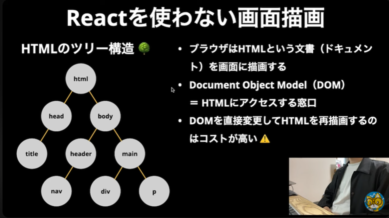


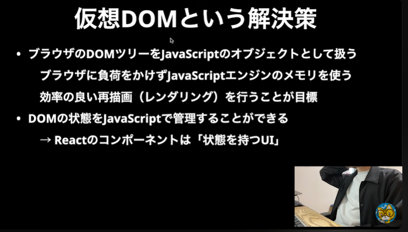

<br>

---
---
---

<br>

<a id="L2"></a>

## ＃02 新・日本一わかりやすいReact入門【基礎編】JSXの記法


### JSXとは


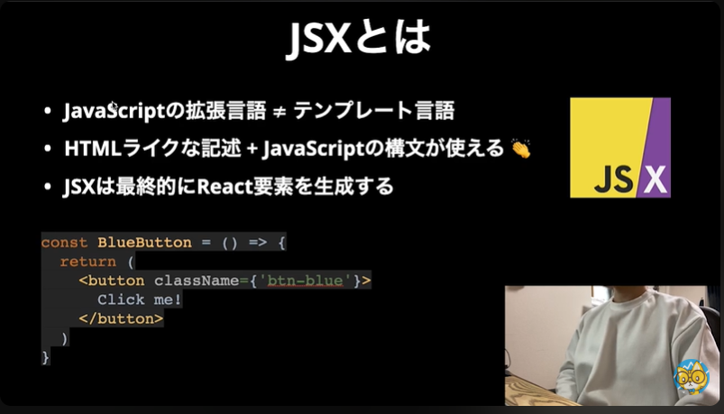


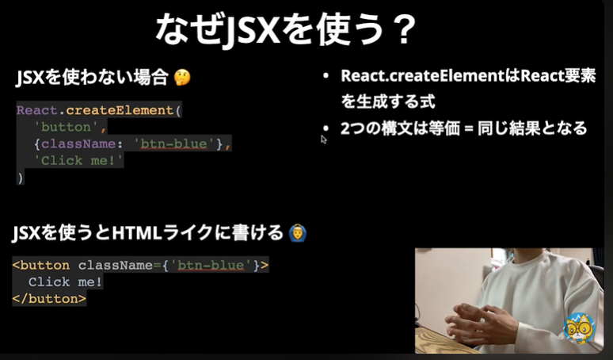


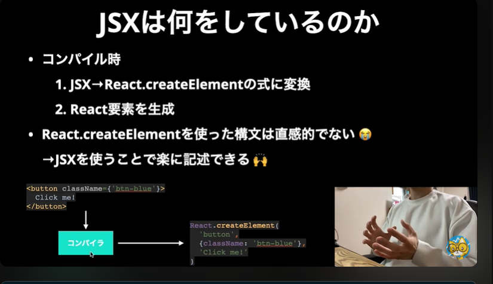


●　JSX でマークアップを記述する

https://ja.react.dev/learn/writing-markup-with-jsx


### JSXの基礎文法

- 「{}」波かっこは【ここからここまではJSだ】という明示になる。
- 階層構造のトップは一つだけにする
- 余計な`div`タグなどを入れない場合は`<React.Fragment>`、省略形で`<>～</>`で埋めてしまう。


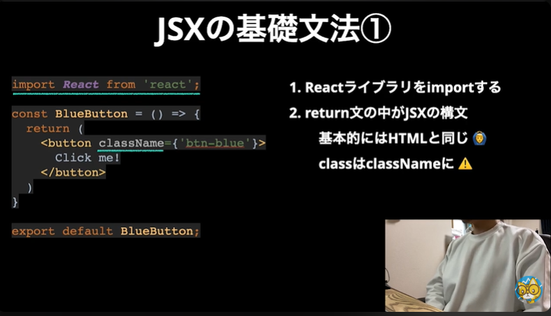


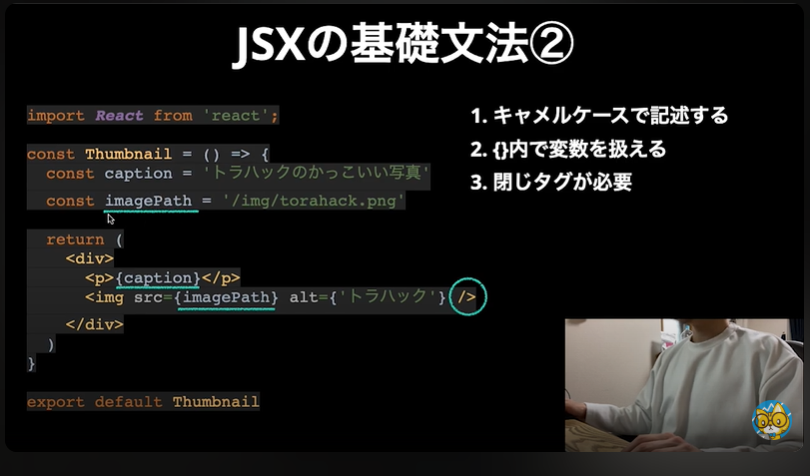


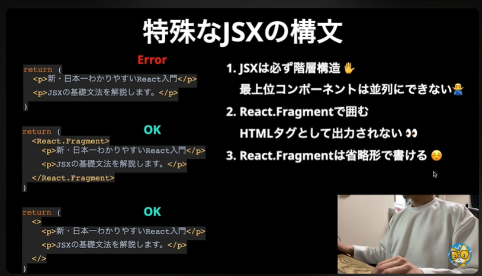


<br>

---
---
---

<br>

<a id="L3"></a>


# ＃03 新・日本一わかりやすいReact入門【基礎編】create-react-appで環境構築

## create-react-appで環境構築

https://www.youtube.com/watch?v=Ym4If5W9SS0&list=PLX8Rsrpnn3IWPoM7-1YPDksRRkamRY25k&index=3

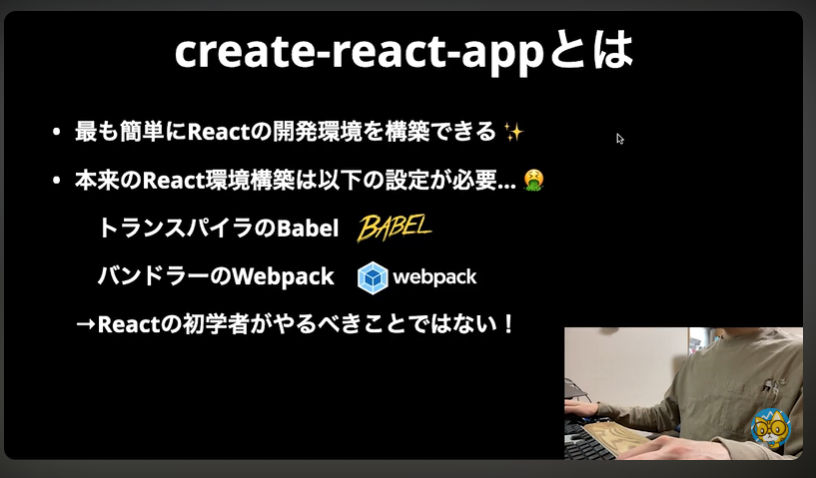


### トランスパイラーとは

```
JSXはそのままでは実行できず、トランスパイラーを使って実行可能なJavaScriptに変換する必要があります。その変換作業のことを__トランスパイリング__、変換することを__トランスパイル__と言います！
```


Reactにおけるトランスパイラー【Babel】の役割

https://qiita.com/micropig3402/items/064394428791144f5488


### バンドラーとは

```
モジュールバンドラーは、JavaScriptやCSSなどの複数のファイルを1つまたは複数の出力ファイルにまとめるためのツールです。
これにより、フロントエンド開発の効率が向上し、Webアプリケーションのパフォーマンスが最適化されます。
代表的なモジュールバンドラーにはWebpackやViteがあります。
```


モジュールバンドラーとは？WebpackやViteの役割と使い方

https://kitsune.co.jp/insights/what-is-module-bundler-webpack-vite/


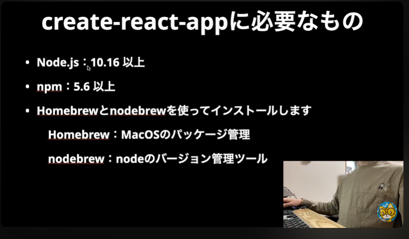


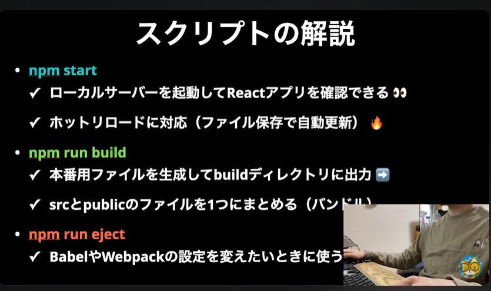

<br>

---
---
---

<br>

<a id="L4"></a>


## ＃04 新・日本一わかりやすいReact入門【基礎編】コンポーネントとprops

https://www.youtube.com/watch?v=Q-df0QgZuhE&list=PLX8Rsrpnn3IWPoM7-1YPDksRRkamRY25k&index=4


### コンポーネントとは

- 見た目と機能を持つUI部品
- コンポーネントを組み合わせてページを作る
- 大きく2種類のコンポーネントに分かれる
    - Class Component  ※現在ではかなり限定的になっている
    - Functional Component


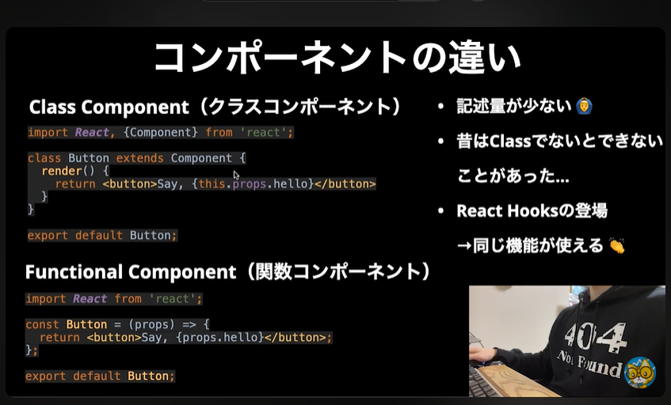


### 何故コンポーネントを使うのか

- <span style="color: #009933;">再利用するため</span>
    - 同じ記述を何度も書く必要がない
- <span style="color: #ffe600;">コードの見通しをよくするため</span>
    - 1コンポーネント1ファイル
    - 別ファイルに分けることでコードが読みやすくなる
- <span style="color: #c951a5;">変更に強くなるため</span>
    - 修正は1か所だけでよいケースもある


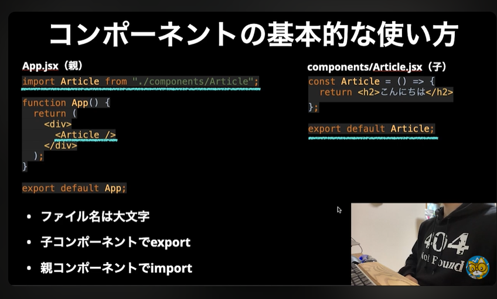


### propsでデータを受け渡す


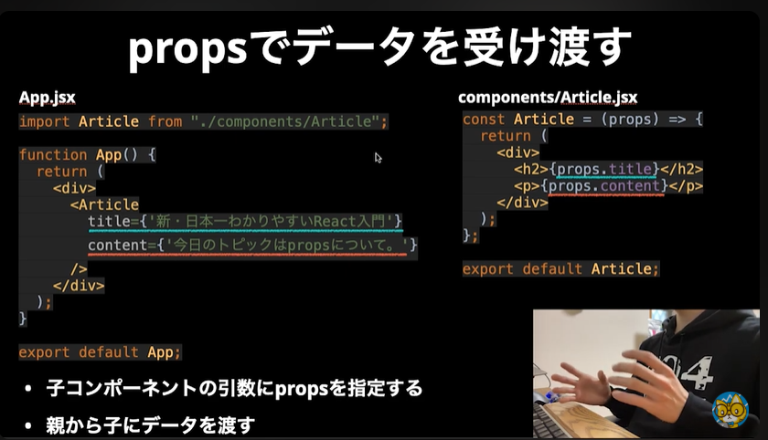


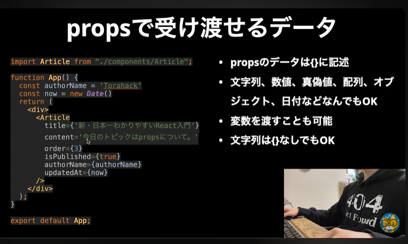


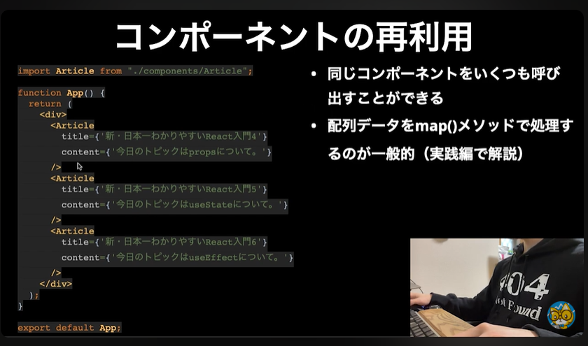


### 補足　Reactのバージョン確認

```javascript
console.log(React.version);
```

または


```sh

1.  npm list react
2.  yarn list react

```

<br>

---
---
---

<br>

<a id="L5"></a>

## ＃05 新・日本一わかりやすいReact入門【基礎編】コンポーネントのimportとexport

https://www.youtube.com/watch?v=Sex6Vc-NJEk&list=PLX8Rsrpnn3IWPoM7-1YPDksRRkamRY25k&index=5


### コンポーネントを分けよう

- 1ファイル=1コンポーネントにすべし
- なぜコンポーネントを分けるのか？
    - <span style="color: #ffae00">責務</span>を明確にする。(何のためのパーツなのか？)
    - 大規模アプリでも<span style="color: #00ff9d">管理しやすく</span>するため。
    - <span style="color: #2bff00">再利用</span>するため。
- <span style="color: #ffae00">別ファイルのコンポーネントはどうやって使うのか？</span>
    - その答えが、`import / export`である。
    - あるファイルで作ったパーツを`export`して、別のファイルで`import`する。


### JavaScriptのモジュール機能とは


モダンフロントエンドでは必須アイテム

- プログラムをモジュールという単位に分割する
- 原則は1ファイル＝1モジュール
- 必要な時に、必要なモジュールのみを読み込む

```javascript

import Article from './components/Article'
// ↑ここでimportしている

function App() {
    return (
        //↓ここでimportしたモジュールを使っている
        <Article
           title={'foo'} 
           content={'bar'}
        />
    );
}

```


(参考) MDN - JavaScript モジュール

https://developer.mozilla.org/ja/docs/Web/JavaScript/Guide/Modules


### default export (名前なしexport)

- 推奨されるexport方法
- 1ファイル=1export
- (A) 1度宣言したアロー関数を`default export`
- (B) 名前付き関数宣言と同時に`default export`

```javascript
//(A) 1度宣言したアロー関数を`default export`
const Title = (props) => {
    return <p> Hello </p>
};
export default Title;

//(B) 名前付き関数宣言と同時に`default export`
export default function Title(props) {
    return <p> Hello </p>
};

//※注：名前なしとなっているが、厳密には「default」という名前になっている。

```


### default import (名前なしeimort)

- `default export`したモジュールをそのまま読み込む
- import モジュール名 from 'ファイkるパス'


```javascript
// Article.jsx(export元)
const Article = (props) => {
    return (
        <div>
            <p>{props.title}</p>
            <p>{props.content}</p>
        </div>
    );
}
export default Article;

// App.jsx(import先)
import Article from './components/Article';

function App() {
    return (
        <Article
            title = {'foo'}
            content = {'bar'}
        />
    );
}

```

### 名前付きexport

- 1ファイルから複数モジュールを`export`したい場合
- Reactでは、エントリーポイント(プログラムが実行を開始する場所や関数)でよく使われる
- エントリーポイントでは、別名exportでも併用する
- 慣例的に`index.js`をエントリーポイントとして定義

```javascript
// helper.js
export const addTax = (price) => {
    return Math.floor(price * 1.1);
}
export const getWild = () => {
    console.log('Get wild and tough');
}

//index.js
export {default as Aritcle} from './Article'
export {default as Content} from './Content'
export {default as Title} from './Title'
//defaultという名前のモジュールをTitleという名前でexport
//Titleコンポーネントでexportされたモジュールは結局は「default」になっているはずだから

```


### 名前付きimport

- 1ファイルから複数モジュールを読み込む
- エントリーポイントから複数コンポーネントを読み込む

```javascript
//エントリーポイントを介して真苗付きimportを【複数】読み込んでいる
import {Content, Title} from './index.js'

//エントリーポイントを使わない場合は
// import Content from './Content.jsx'
// import Title from './Title.jsx'

const Article = (props) => {
    return (
        <div>
            <Title title={props.title} />
            <Content content={props.content} />
        </div>
    );
}
export default Article;

//単純なコンポーネント群であれば、わざわざコンポーネントにしなくてもよいが
//【責務分け】が基本であり、コードの見通しをよくして、変更の手間を減らすために必要

```


<br>

---
---
---

<br>

<a id="L6"></a>

## 


<br>

---
---
---

<br>


# 付録１ : Claudeから教わった、JSXファイル、TSXファイルについて。


```
React 19でもJSXファイルは問題なく使用できます。TSXファイルが主流になっているのは、TypeScriptの普及によるものです。

●　JSXファイルの使用可能性
JSXファイルは現在でも完全にサポートされており、使用に問題はありません。多くのプロジェクトでTSXが使われているのは、TypeScriptの型安全性やIDE支援などの利点があるためです。

●　TSXの採用時期
TSXファイルはReact自体の機能ではなく、TypeScriptの機能です：

TypeScript 1.6（2015年9月）でJSX構文のサポートが追加
この時からTSXファイル（TypeScript + JSX）が使用可能に
Reactのバージョンとは独立した機能

●　TSXファイル内でのJSX使用
TSXファイルの中でJSXは普通に使用できます。TSXは「TypeScript + JSX」の略で、むしろJSXを使うためのファイル形式です：

●　ファイル拡張子の選択基準
- JSX: JavaScriptでReactコンポーネントを書く場合
- TSX: TypeScriptでReactコンポーネントを書く場合

```

```typescript

tsx// TSXファイル内のJSX例
import React from 'react';

interface Props {
  name: string;
}

const MyComponent: React.FC<Props> = ({ name }) => {
  return (
    <div>
      <h1>Hello, {name}!</h1>
      <p>This is JSX inside a TSX file.</p>
    </div>
  );
};

export default MyComponent;

```

